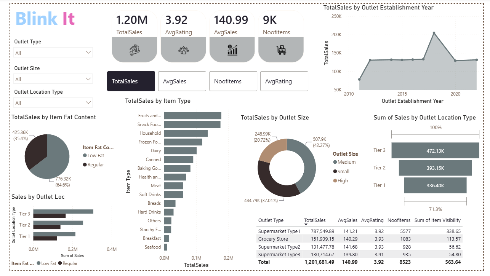

# Blinkit Sales Analysis – Power BI Dashboard

## 📊 Project Overview

This project is an interactive Power BI dashboard created to analyze Blinkit sales data and generate useful business insights.

The dashboard focuses on sales performance, product categories, outlet characteristics, customer ratings, and key business KPIs.

## 🛠️ Tools & Technologies

- Power BI
- Data Analysis
- Data Visualization
- DAX
- Power Query

## 📌 Key KPIs

- Total Sales
- Average Sales
- Number of Items
- Average Customer Rating

## 📈 Dashboard Analysis

The dashboard provides insights into:

- Sales trends over time
- Sales by outlet size
- Sales by outlet location
- Sales by item type
- Average rating by item type
- Fat content analysis
- Outlet performance
- Product-level performance

## 🔍 Key Features

- Interactive filters and slicers
- KPI cards
- Multiple visualizations
- Sales trend analysis
- Category-level analysis
- Outlet performance analysis
- Interactive Power BI dashboard

## 🖼️ Dashboard Preview

## 📂 Project Files

- `Blinkitdata (1).pbix` – Power BI dashboard project
- `blinkit-dashboard.png` – Dashboard preview

## 🎯 Objective

The objective of this project is to demonstrate practical skills in data cleaning, data analysis, visualization, dashboard development, and extracting business insights using Power BI.
